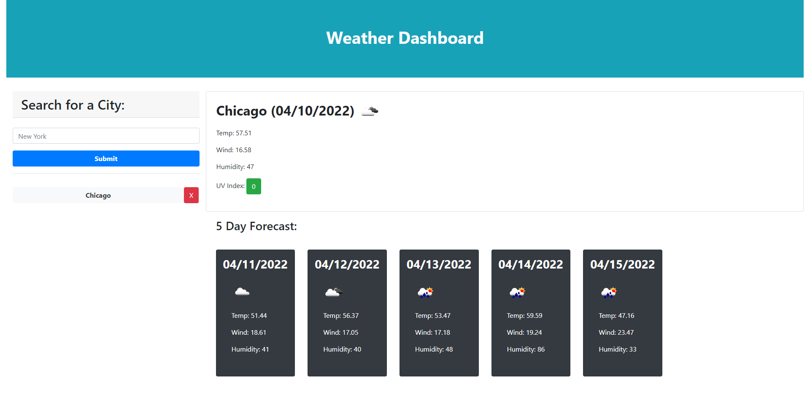

# Weather Dashboard
A simple weather dashboard that uses openweatherapi to grab a weather forecast.

## HTML / CSS / JavaScript
The dashboard takes a user submitted city and programatically creates a weather forecast using API calls

## Deployed Site
[Weather Dashboard](https://josephlmurray.github.io/weather/)

## Screen Shot

### Points of Interest
* No data is shown if no search history exists

* If search history exists, the page automatically pulls information for the top most city

* All cards are generated programatically 
